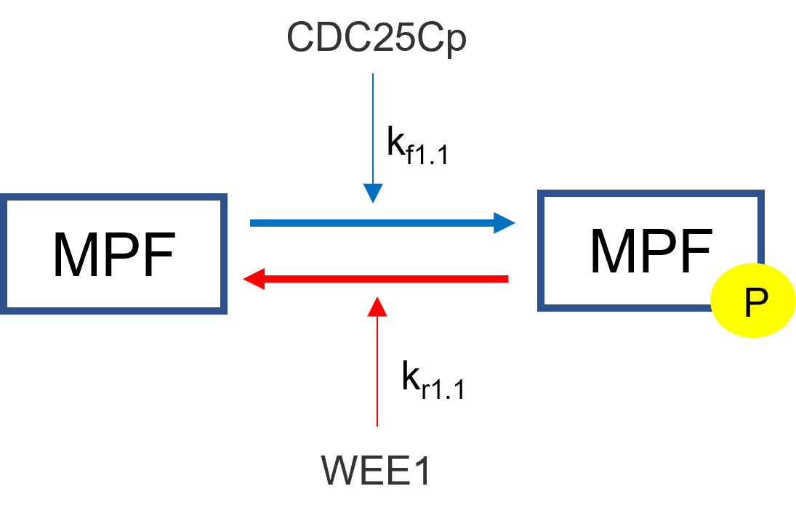
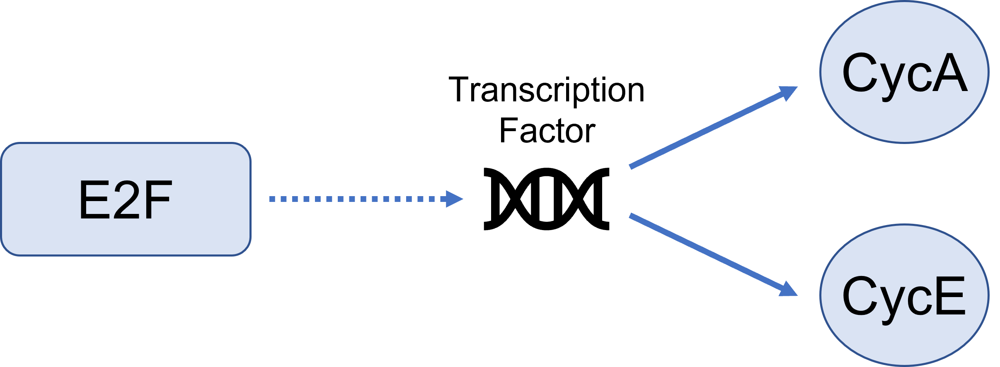

Law of Mass Action 
----------------------------
Chemical reactions are derived using the law of mass action. Given the following
chemical reaction scheme: 

.. math::
    \begin{equation*}
        aA + bB \xleftrightarrow[k_{-1}]{k_1} cC + dD
    \end{equation*}

where a, b, c, d are stoichiometric coefficients and A, B, C, D are the chemical
species. The law is as follows:

.. math:: 
     \begin{equation*}
        -\frac{1}{a}\frac{d[A]}{dt} = -\frac{1}{b}\frac{d[B]}{dt} = 
        \frac{1}{c}\frac{d[C]}{dt} = \frac{1}{d}\frac{d[D]}{dt} =
         k_1[A]^a[B]^b - k_{-1}[C]^c[D]^d 
    \end{equation*}

From the above law, each individual term is derived below:

.. math:: 
    \begin{align*}
        \frac{d[A]}{dt} &= -a*k_1[A]^a[B]^b + a*k_2[C]^c[D]^d \\
        \frac{d[B]}{dt} &= -b*k_1[A]^a[B]^b + b*k_2[C]^c[D]^d \\
        \frac{d[C]}{dt} &= c*k_1[A]^a[B]^b - c*k_2[C]^c[D]^d \\
        \frac{d[D]}{dt} &= d*k_1[A]^a[B]^b - d*k_2[C]^c[D]^d
    \end{align*}

Each individual equation will be added to their overall flux differential
equation in the differential equation solver section.

Law of Mass Action with Regulation
--------------------------------------------
Mass action with regulation is for chemical reactions who have rate constants 
that are dependent on other species. An example is the regulation of inactive 
MPF to active MPF in the cell cycle by WEE1 and CDC25Cp. In this example, 
inactive MPF is phosphorylated by CDC25Cp and dephosphorylated by WEE1. These 
regulators are not directly affected in the their differential equations in 
this situation while inactive and active MPF are. We have the same derivation
as mass action except the rate constants are changed to reflect the regulation.  

The regulators will take the respective place of the rate constants in the 
mass action derivation.  In the mass action derivation above for "a" and "b"
we have: 

.. math::
    \begin{align*}
        \frac{d[A]}{dt} &= -a*k_1[A]^a[B]^b + a*k_2[C]^c[D]^d \\
        \frac{d[B]}{dt} &= -b*k_1[A]^a[B]^b + b*k_2[C]^c[D]^d 
    \end{align*}

Adding regulator replaces the respective rate constant with the sum of 
its regulators and rate constants:

.. math:: 
    \begin{align*}
        \frac{d[A]}{dt} &= -a*(\sum{[kf_i*reg_i]})[A]^a[B]^b +
        a*(\sum{[kr_i*reg_i]})[C]^c[D]^d \\
        \frac{d[B]}{dt} &= -b*(\sum{[kf_i*reg_i]})[A]^a[B]^b +
        b*(\sum{[kr_i*reg_i]})[C]^c[D]^d
    \end{align*}

Using the above example, we get the following result:

.. math::
    \begin{align*}
        \frac{d[MPF]}{dt} &= -(k_{f1.1}*CDC25Cp)*MPF - (k_{r1.1}*WEE1)*MPFp \\
        \frac{d[MPFp]}{dt} &= (k_{f1.1}*CDC25Cp)*MPF + (k_{r1.1}*WEE1)*MPFp  
    \end{align*}

Synthesis
------------------------------
Synthesis by rate has a species generated at a specific rate. This is useful 
for when the user does not particularly now what is causing the synthesis but
knows how quickly it is being produced. It simply creates a constant rate of
production. 

.. math::
    \begin{equation*}
        \frac{d[Species]}{dt} = k_{syn}
    \end{equation*}

where,

:|ksyn|: synthesis rate of species

.. |ksyn| replace:: :math:`k_{syn}`

Synthesis by Factor 
------------------------------------

The "By Factor" law is used when a factor directly influences the synthesis of 
a species but is not directly converted. An example of this is in the Cell
Cycle when the molecule E2F activates transcription factors that synthesize 
Cyclin E and Cyclin A. If the cell contains no E2F, then there is no synthesis 
of Cyclin E or A. 

There is only one resultant mathematical flux from this type of synthesis and 
that is the species being synthesized. The factor causing the synthesis does 
not have its flux altered. The general resulting equations are: 

.. math::
    \begin{align*}
        \frac{d[Species]}{dt} &= k_{syn}*[Factor] \\
        \frac{[Factor]}{dt} &= 0
    \end{align*}

where,

:|ksyn|: synthesis rate of species
:Species: species that is being synthesized
:Factor: factor that is causing the synthesis

In relation to the above E2F equation, the differential equations are: 

.. math::
    \begin{align*}
        \frac{d[CycA]}{dt} &= k_{syn}*[E2F] \\
        \frac{d[CycE]}{dt} &= k_{syn}*[E2F] \\
        \frac{d[E2F]}{dt} &= 0 \\
    \end{align*}

Degradation
------------------------------
These reactions are dependent on a rate constant. Here we have two specific 
options where the degradation can be concentration dependent or not. 
Often degradations are concentration dependent on themselves, meaning there is 
more degradation at higher concentrations and vice versa. The following is the 
derivation for a concentration dependent degradation: 

.. math:: 
    \begin{equation*}
        \frac{d[Species]}{dt} = -k_{deg}*[Species]
    \end{equation*}

where,

:|kdeg|: degradation rate constant
:Species: species being degraded

.. |kdeg| replace:: :math:`k_{deg}`

When the degradation is not concentration dependent, the resulting flux is:

.. math:: 
    \frac{d[Species]}{dt} = -k_{deg}

When products are made, they are the opposite sign of the above reactions. 
For example, for concentration dependent reactions with one degradation to two 
products we would have the resulting differential equations:

.. math::
    \begin{align*}
        \frac{d[Species]}{dt} = -k_{deg}*[Species] \\
        \frac{d[Product 1]}{dt} = +k_{deg}*[Species] \\
        \frac{d[Product 2]}{dt} = +k_{deg}*[Species]
    \end{align*}

Degradation by Enzyme
-----------------------------------------
This degradation option is a basic enzyme reaction using Michaelis Menten 
kinetics where the substrate is the species to be degraded and there often 
is no product. The resulting mathematical flux for the degraded substrate 
would be:

.. math::
    \frac{d[S]}{dt} = -V_{max}\frac{[S]}{K_m+[S]} = 
    -(k_{cat}*[E])\frac{[S]}{K_m+[S]}

where,

:|Vmax|: Maximum Velocity
:E: Enzyme Concentration
:S: Substrate Concentration
:P: Product Concentration
:|KM|: Michaelis Menten Constant
:|kcat|: Catalytic Rate of Enzyme Reaction

.. |Vmax| replace:: :math:`V_{max}`
.. |KM| replace:: :math:`K_M`
.. |kcat| replace:: :math:`k_{cat}`

There is an option to add a product (P), which results in the mathematical 
flux equations to break down to pure Michaelis Menten kinetics for the product 
and substrate which would have the same equation above except with a positive 
sign:

.. math::
    \begin{align*}
        \frac{d[S]}{dt} &= -V_{max}\frac{[S]}{K_m+[S]} = 
        -(k_{cat}*[E])\frac{[S]}{K_m+[S]} \\
        \frac{d[P]}{dt} &= +V_{max}\frac{[S]}{K_m+[S]} = 
        +(k_{cat}*[E])\frac{[S]}{K_m+[S]}
    \end{align*}