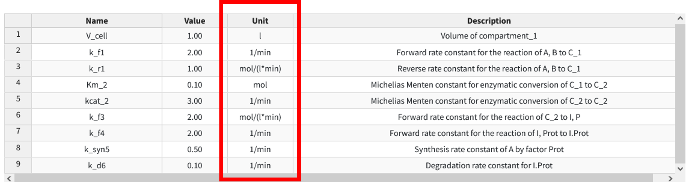
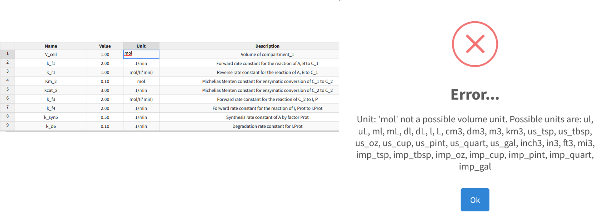

Units 
===================

BioModME supports basic units for species and parameters in a model. The unit 
definition system is created from the R package "measurements" 
(https://cran.r-project.org/web/packages/measurements/measurements.pdf). This 
package supports several commonly used units. The user can define the units 
how they want and the application will convert them to a base unit in the 
backend for processing.

Unit Conversion 
-------------------------
To convert units, go to the units section of the data table for the 
variable.  For example, we will look at a parameter table example.  The third 
column in the table is units. By clicking the units square, we can change the 
unit type. 

The program will only allow you to convert to accepted units for that type.  
Meaning, for example, V_cell has the units of litter, so it can only be 
changed to another unit of volume (such as mL). For a list of all units and 
their values, see the :doc:`unit definition <Unit Definitions>` section. If you attempt to convert to a 
unit that is not allowed, a warning will appear. 

Converting Compound Units
---------------------------

Often parameter values will have multiple unit definitions. From the parameter
table example above, the parameter "k_r1" has a unit definition of mol/(l*min).
This has units of count, volume, and time. To convert this, the user needs to 
ensure they repeat the whole expression changing the appropriate unit in the 
proper place.  For example, 

.. math::
    (mol/(l*min))

is an appropriate expression.  However, 

.. math::
    umol/(min*L)

will return an error. As well as not putting the mathematical notion back in 
its correct place (the division, multiplication, and parenthesis) or having any
of the units not be the correct conversion type (i.e. using volume units when
you should be using temp). 

Unit Definitions
--------------------------
Below are the unit definitions used in this application. The left-hand side 
is the term that can be put into the application (parenthesis terms are 
alternat acceptable names) while the right side is the definition of the unit
abbreviation. 

**Count**

:fmol: femto-mol
:pmol: pico-mol
:nmol: nano-mol
:umol: micro-mol
:mmol: milli-mol
:mol: mol

**Flow**

:ml_per_sec: milliliter per second
:ml_per_min: milliliter per min
:ml_per_hr: milliliter per hour
:l_per_sec (LPS): liter per second 
:l_per_min (LPM): liter per min 
:l_per_hr (LPH): liter per hour 

**Temperature**

:C: Celsius
:F: Fahrenheit
:K: Kelvin
:R: Rankine

**Time**

:nsec: nano-second
:usec: micro-second
:msec: milli-second
:sec: second
:min: minute
:hr:  hour
:day: day
:wk: week
:mon: month
:yr: year
:dec: decade
:cen: century

**Volume**

:ul (uL): micro-Liter
:ml (mL): milli-Liter
:dl (dL): deci-Liter
:l (L): Liter
:us_tsp: US teaspoon
:us_tbsp: US tablespoon
:us_oz: US ounce
:us_cup: US cup
:us_pint: US pint
:us_quart: US quart 
:us_gal: US gallon
:cm3: centimeter cubed
:dm3: decimeter cubed
:m3: meter cubed
:km3: kilometer cubed
:in3: inch cubed
:ft3: feet cubed

