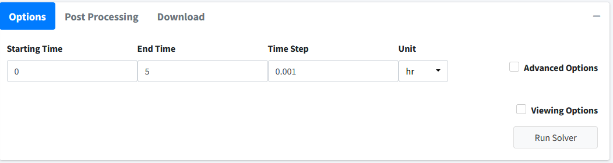
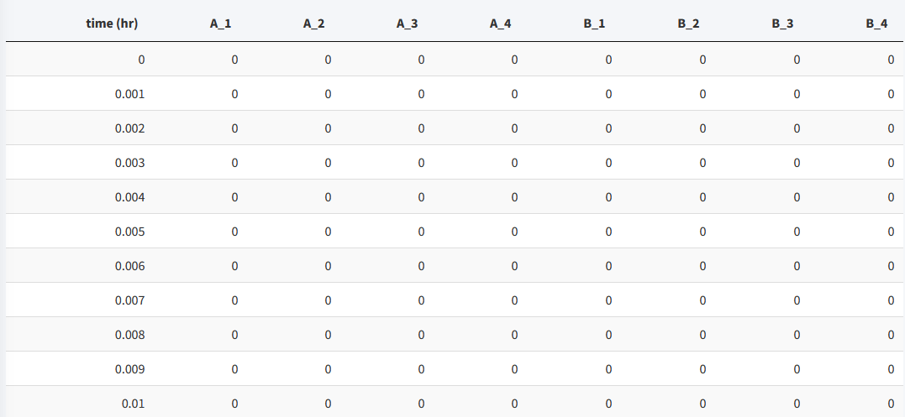
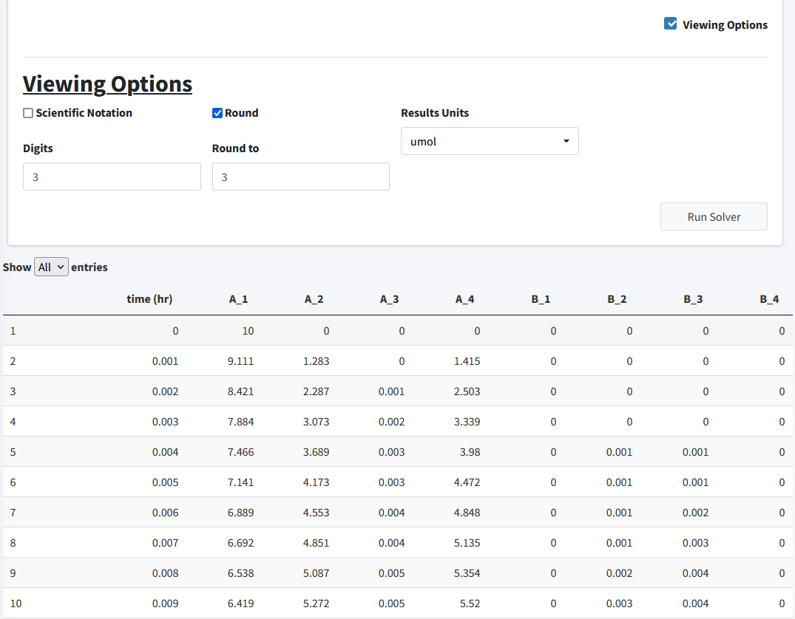
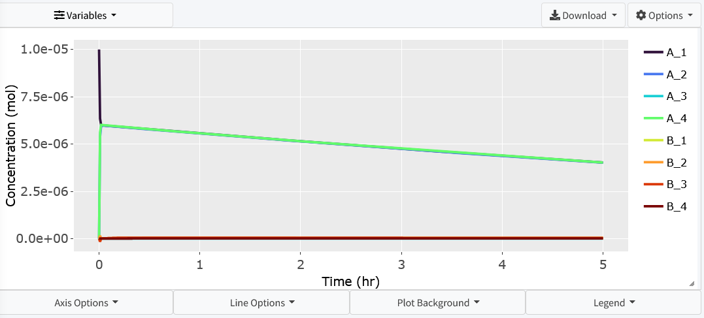
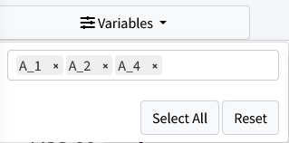
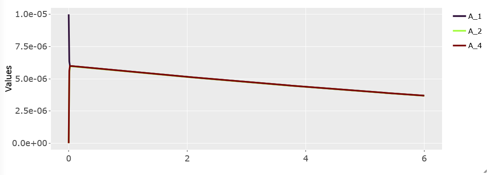

==================================
Results
==================================

In this section, we will cover executing the model and its different outputs.

Solve Model 
-----------------------

Navigate to the "Execute Model" tab on the lefthand tabbar. This tab solves our 
model and provides us with the options to customize the solver. For this model,
we will just solve using the standard options:

#. Enter the following times: Starting = 0, End = 5, Step = 0.001, Unit = hr.  
   This generates the model to be solved and integrated at time points 0, 0.001,
   0.002.....5.998, 5.999, 6. 
#. Press the "Run Solver" button. 
#. An output table should be generated with the concentration of each species 
   along each time step of the solved model. 

You can download this solved model data to a csv file in the 
download tab on this page.  Post processing is not used in this tutorial. 

.. note:: BioModME is set by default to show the results table rounded to 3
         digits. Most terms in these results at the beginning will round
         to 0. To change this, check the **Viewing Options** box and turn 
         off the **Round** option or turn on the **Scientific Notation** 
         option. 

Below is how the table for this model should look after the initial solve: 

To see the values for the model in a good form, we will change the viewing 
options:

#. Click the **Viewing Options** Checkbox. 
#. Change Results Units to **umol**.

In this section, we will examine the plotting of this model.

Visualization
----------------------------------------

Move to the **Visualization** tab.  The starting plot from the model should
look like the following:

For this problem we want to examine how the concentration of **A** varies 
throughout the bloodsteam (**A_1**, **A_2**, **A_4**). Click the **Variable**
dropdown and remove all necessary variables: 

The resulting plot should look like: 

