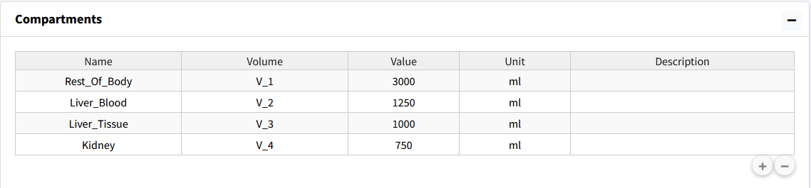

============================
Create Compartments
============================

We will start by setting up our four compartments in this model:
Rest_Of_Body, Liver_Blood, Liver_Tissue, Kidney. 

Steps: 

#. Go to the **Compartments** box in the **Create Model** tab.
#. Press the "**+**" button three times to add three compartments. 
#. Change the Names of the compartments in the table to **Rest_Of_Body**, 
   **Liver_Blood**, **Liver_Tissue**, and **Kidney**.
#. Volume names are autogenerated with numerical numbering.
#. Change the volume value and units to match parameter table (these values can
   also be changed in the parameter table for the model). 

The result should be the following table: 

