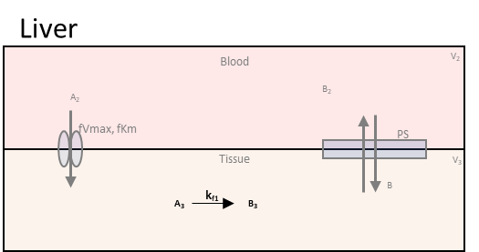
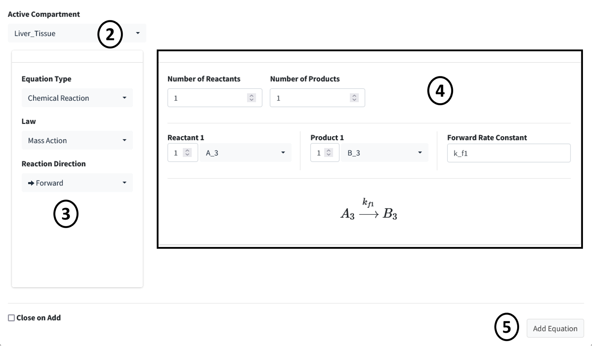

============================
Add Equations
============================

This tutorial model has only one reaction: the conversion of A to B (**A3** & 
**B3**) in the liver tissue.

Steps: 

#. Scroll down to the **Reactions** box in the **Create Model** tab. Press 
   the addition button below the equation table. 
#. Change the **Active Compartment** to "Liver_Tissue".
#. Make sure **Mass Action** is selected as the **Law** for this reaction. 
   Change the **Reaction Direction** to "Forward" for this is a one way 
   reaction.
#. This reaction has one reactant and one product. Make sure **Reactant 1** is 
   **A_3** and **Product 1** is **B_3**. Make the **Forward Rate Constant** 
   to **k_f1**, if not already. You can set the parameter value here or later
   on the parameter table. For this tutorial most values will be set on the 
   parameter table.
#. Press the **Add Equation** button. 

