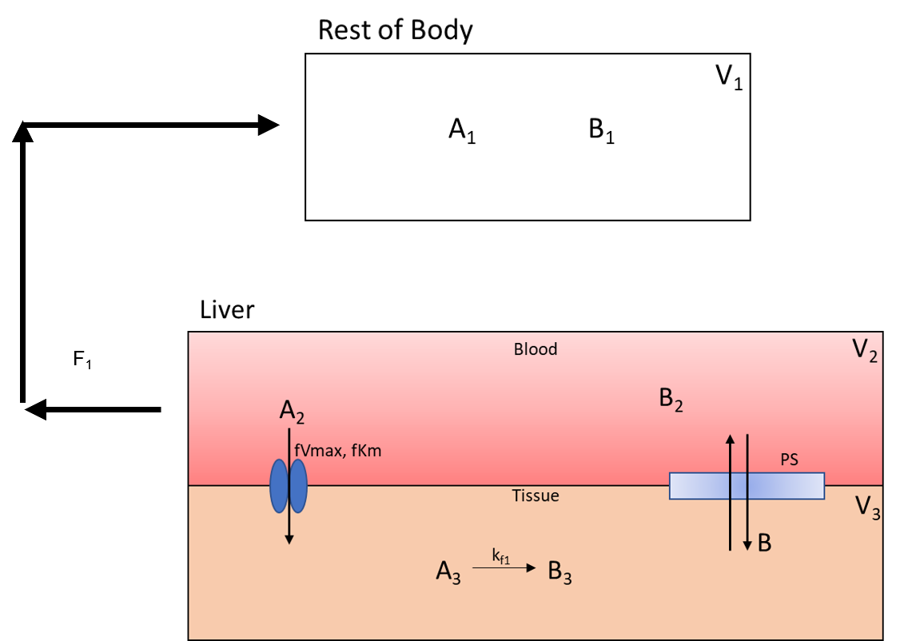
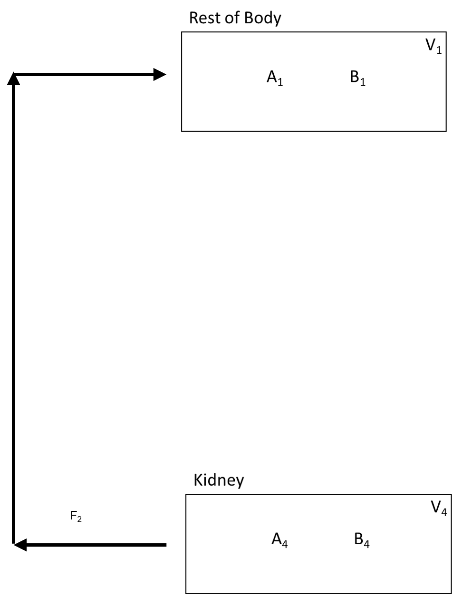
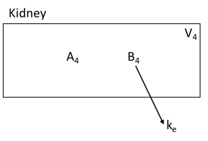
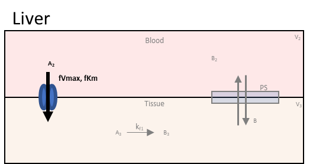
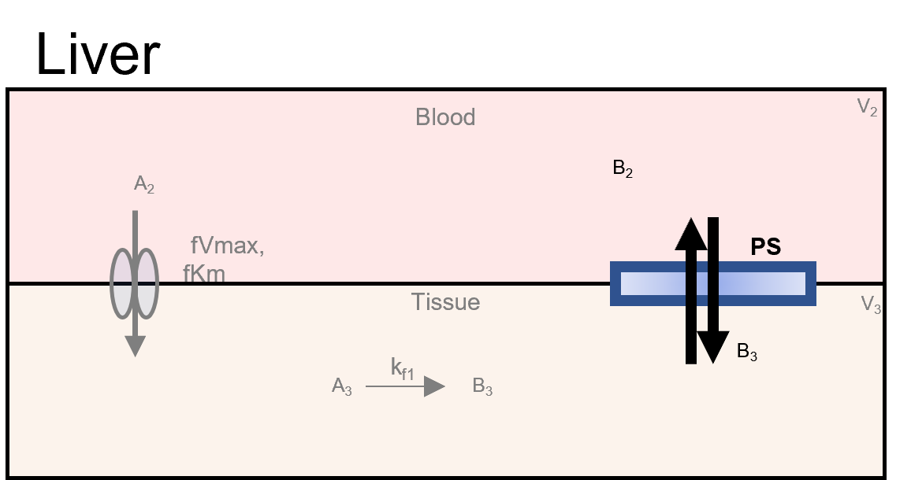

===============================
Add Compartment Inputs/Outputs
===============================

In this section of the tutorial, we will cover how to add flows, inputs, and 
outputs of compartments to the model. Begin by scroling to the 
**Input/Output** box on the **Create Model** tab. Press the addition button to 
begin adding the below flows between species information.
Again, here is the overall flow model: 

.. container:: bordergrey

    .. figure:: images/flow_diagram.png
        :scale: 40%
        :align: center

In each subsequent section we break down the flows into individual components.

1. Flow Out of Body
----------------------------

The flow out of the **Rest_Of_Body** is split into two flow rates as it moves
species **A** and **B** to the **Liver_Blood** and **Kidney**.  Below is the 
part of the flow diagram we will be entering:

.. container:: bordergrey

    .. figure:: images/flow_diagram_rob.png
        :align: center
        :scale: 40%

#. In **Options** select **Flow Between Compartments**. This is used to account
   for flows leaving one compartment and entering one or more compartments.
#. Select the **Split Flow** checkbox. This option is selected when one outflow
   is being split into multiple flows.  Keep **Number of Splits** to **2** as
   we are splitting the flow to two compartments. 
#. Set the information for the compartment the flow is leaving from. It has the 
   following specifications: 

   * **Flow_Out_of**: Rest_Of_Body
   * **Species Out**: A_1
   * **Flow Variable**: F
   * **Flow Value**: 5

   Current specifications need to have species in flow entered one at a time. 
   Meaning a new flow will be added for species **B**. With all parameters, 
   values can be changed later in the parameter section.

#. Set the information from the first split flow into **Liver_Blood**. Enter 
   the following: 

   * **Flow_Out_of**: Liver_Blood
   * **Species Out**: A_2
   * **Flow Variable**: F_1
   * **Flow Value**: 3

#. Set the information from the second split flow into **Kidney**. Enter 
   the following: 

   * **Flow_Out_of**: Kidney
   * **Species Out**: A_4
   * **Flow Variable**: F_2
   * **Flow Value**: 2

#. Press the **Add** button to add this flow. You can select the 
   **Keep Active** checkbox on the bottom of the page to prevent this page
   from closing on pressing the add button. 

   .. container:: botTopMargin

    .. figure:: images/io_2_flow_between_A_marked.png
        :align: center

#. Repeat the previous steps for species **B**. This should involve only 
   changing the **Species** dropdowns. 

    .. figure:: images/io_3_flow_between_B.png
        :align: center

.. note::
    When adding **B**, we are reusing the flow variables **F**, **F_1**, and 
    **F_2**.  BioModME allows multiple saving of parameters but will check that
    the parameters have the same base unit.  If not, the parameter will be 
    rejected. The value for the parameter will overwrite on each new overwrite
    of the parameter. 

2. Flow Back: Liver to Body
----------------------------

The flow back from the liver to the rest of the body looks like: 

This is like the previous step but with the compartments switched around.

Steps: 

#. Make sure **Options** is still on **Flow Between Compartments**. 
#. Turn off **Split Flow**. 
#. Set the information for the compartment the flow is leaving from. It has the 
   following specifications: 

   * **Flow Out Of**: Liver_Blood
   * **Species Out**: A_2
   * **Flow Variable**: F_1
   * **Flow Value**: 3

#. Set the information for the compartment the flow is entering. It has the 
   following specifications: 

   * **Flow Into**: Rest_Of_Body
   * **Species In**: A_1

#. Press the **Add** button to add this flow. 

    .. container:: botTopMargin

        .. figure:: images/io_4_flow_back_A_lb_marked.png
            :align: center

#. Repeat the previous steps for species **B**. This should involve only 
   changing the **Species** dropdowns. 

    .. figure:: images/io_5_flow_back_b_lb.png
        :align: center

3. Flow Back: Kidney to Body
-----------------------------

The flow back from the kidney to the rest of the body is: 

Steps:

#. Make sure **Options** is still on **Flow Between Compartments**. 
#. Check that **Split Flow** is off. 
#. Set the information for the compartment the flow is leaving from. It has the 
   following specifications: 

   * **Flow Out Of**: Kidney
   * **Species Out**: A_4
   * **Flow Variable**: F_2
   * **Flow Value**: 2

#. Set the information for the compartment the flow is entering. It has the 
   following specifications: 

   * **Flow Into**: Rest_Of_Body
   * **Species In**: A_1

#. Press the **Add** button to add this flow. 

    .. container:: botTopMargin

        .. figure:: images/io_6_flow_back_a_kidney_marked.png
            :align: center

#. Repeat the previous steps for species **B**. This should involve only 
   changing the **Species** dropdowns. 

    .. figure:: images/io_7_flow_back_b_kidney.png
        :align: center

4. Clearance of A From Kidney
-------------------------------

Drug A is excreted from the kidney at a constant rate. The isolated process is 
shown below:

Steps: 

#. Select **Clearance** in the **Options** dropdown. 
#. Enter the following information in the main box: 

   * **Compartment**: Kidney
   * **Species**: B_4
   * **Rate**: k_e

#. Press the **Add** button to add the clearance of B from the kidney. 

.. container:: bordergrey2

    .. figure:: images/io_8_clearance_marked.png
        :align: center

5. Facilitated Diffusion of A
-----------------------------

The next two seconds will look at diffusion processes from the liver blood 
to the liver tissue and back.  Below is the facilitated diffusion of molecule
**A** from the liver blood to the liver tissue. 

Steps: 

#. Select **Facilitated Diffusion** in the **Options** dropdown. 
#. Enter the following information in the first row of the main box: 

   * **From Compartment**: Liver_Blood
   * **From Species**: A_2
   * **Vmax**: fVmax_1
   * **Km**: fKm_1

#. Enter the following information in the second row of the main box: 

   * **To Compartment**: Liver_Tissue
   * **From Species**: A_3

#. Press the **Add** button to add this facilitated diffusion flow to the model. 

.. container:: bordergrey2

    .. figure:: images/io_9_facdif_marked.png

6. Simple Diffusion of B
-----------------------------

Steps: 

#. Select **Simple Diffusion** in the **Options** dropdown. 
#. Enter the following information in the first row of the main box: 

   * **Compartment**: Liver_Blood
   * **Species**: B_2
   * **Diffusivity Coefficient**: PS

#. Enter the following information in the second row of the main box: 

   * **Compartment**: Liver_Tissue
   * **Species**: B_3

   .. note:: 
        The order of entered compartments and species does not matter for
        simple diffusion.

#. Press the **Add** button to add this simple diffusion flow to the model.

.. container:: bordergrey2

    .. figure:: images/io_10_simpdiff_marked.png
        :align: center

This should be the last term entered in the Input/Output box. There should be 
nine terms in the results table. 