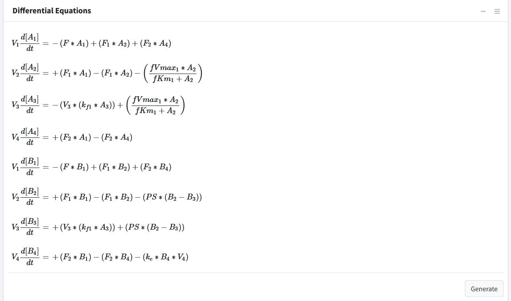

Differential Equations 
=========================

Navigate to the final box **“Differential Equations”**. 

This tab is used to generate and see the mathematical equations that govern 
our model.  This tab will begin with all species being equal to “0” and gets 
auto-generated based on reactions added. The "Generate" button will refresh the 
equations, if for any reason they need to be refreshed.  

Press the “Generate” button to solve the system for its differential equation 
output and display them in text form. 

**Note:** The right sidebar of the "System of Differential Equations" box has an 
option for viewing the differential equations including turning off the math 
rendering and showing each derivation line as a newline for each differential
equation. 