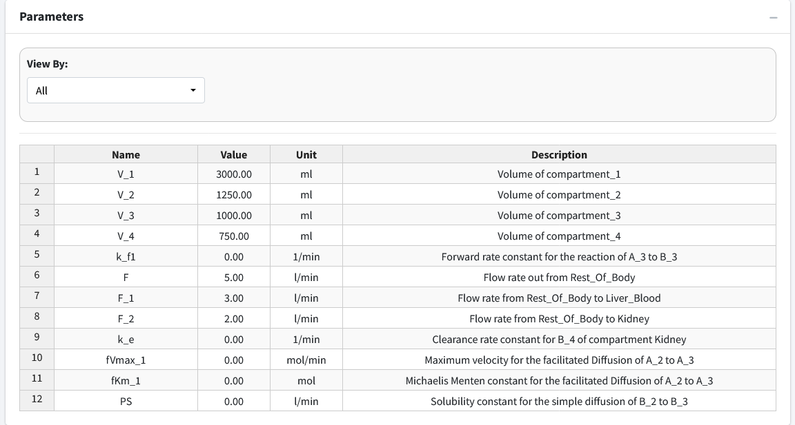
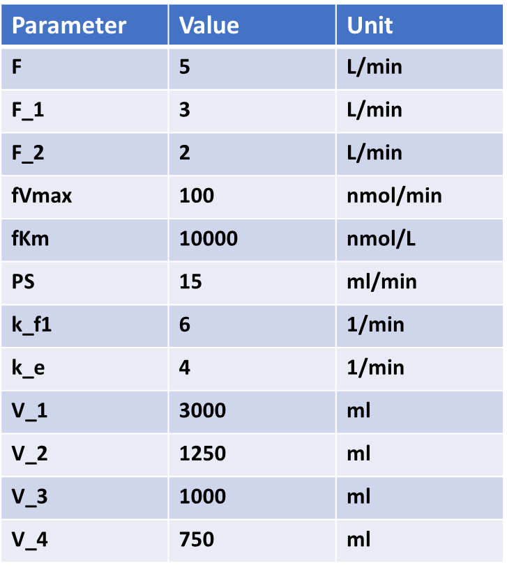
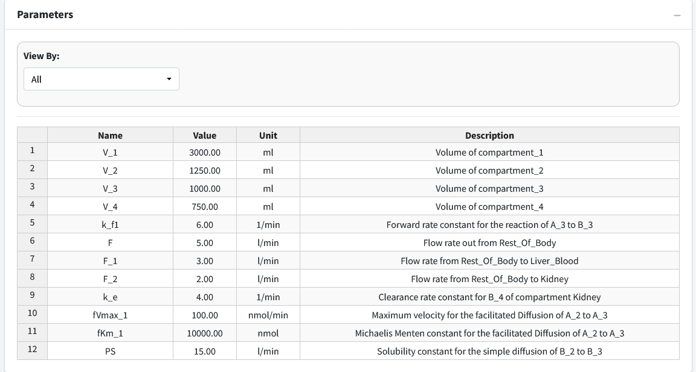

Parameters 
=============

Navigate to the next box: **Parameters**. 

Below is the generated parameter table that has been created so far by the 
above entered information. All descriptions are pregenerated based on where 
the parameter originated. Like other tables, all values are editable.

The parameter values for the model are as follows: 

The below figure shows the parameter table with the values entered.

.. note:: In the Figure above, we did not keep the units of our parameters 
          consistent. In some cases, ml was used and in others liters was used.
          This is okay.  The application converts all units to a "base" unit 
          in the background and performs all calculations at that base level.