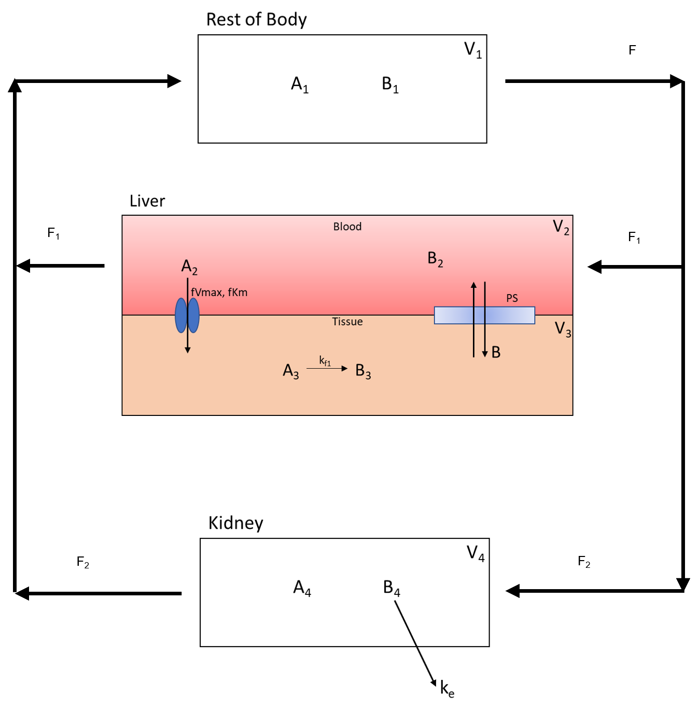
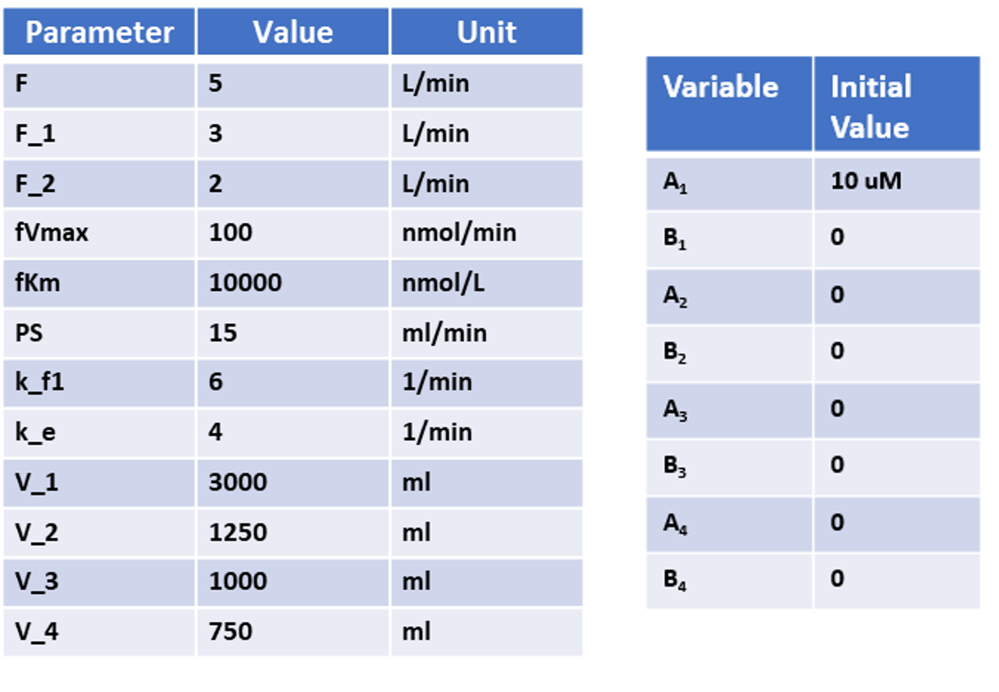

============================
Multi-Compartmental Model
============================
A bolus of a neutral drug “A” was administrated intravenously (i.v.) at time 
t = 0. Within the liver, “A” can diffuse (unidirectional) from liver blood 
region tissue liver tissue region via facilitated diffusion with Vmax 
(nmoles/min) and Km (Molar). Within the liver cells, “A” is converted to 
“B” via a chemical reaction that follows the law of mass action with a first 
order rate constant k1 (1/min). The product “B” can also diffuse 
(simple diffusion) between liver tissue region and blood region with a 
permeability-surface area product PS (ml/min). Within the kidneys, “B” is 
excreted from the blood region via a linear process with a rate constant ke 
(1/min).

The following are the parameter and concentration tables for the model: 

In the following sections of this tutorial, we will design the above 
multi compartment method.

The contents focus on:

#. Adding multiple compartments.
#. Adding variables between compartments. 
#. Properly assigning flows between compartments 
#. Using transporters to pass species between compartments.

To use the online version of this application visit
https://biomodme.ctsi.mcw.edu/.  Note this app is stored on an Rshiny server 
that closes unused applications after 15 minutes of inactivity. Your current
model can be downloaded in the "Export" tab as an .RDS file and can be loaded
in by opening the right sidebar of the application. The application can also 
be directly downloaded at 
https://github.com/MCWComputationalBiologyLab/BioModME and opened using the
R programming language using stand shiny app protocol.

.. toctree::
    :hidden:

    tutorial_mc/1_construct_model
    tutorial_mc/2_model_results