==============================
Parameter Estimation Tutorial
==============================

This is a basic parameter estimation tutorial. To download the example data 
used in this tutorial go to 
https://github.com/Jwomack7512-bio/BobTheBuilder/blob/main/shared_files/Nicotine_cigarette.csv.

We assume you have basic knowledge of creating a model and will skip showing
every step of that process. Please see the 
:doc:`parameter estimation documentation <backend/parameter_estimation>`
for details on the solver and options available to use in the solver. 

We will construct the following simple three compartment model: 

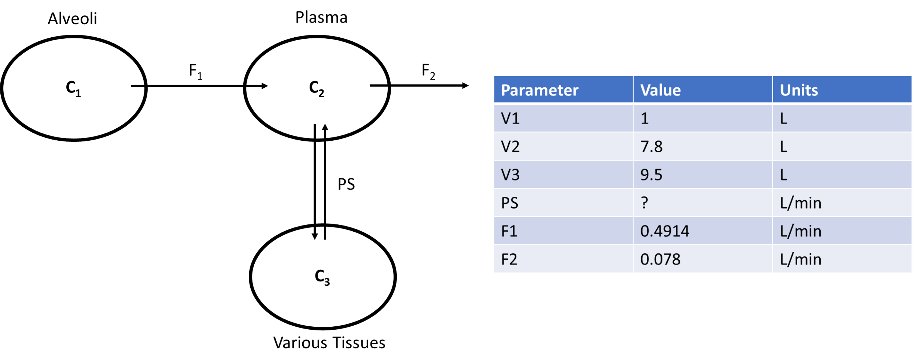

In the above diagram, we model the concentration of a drug, Nicotine (**C**), as
it moves from the alveoli of the lungs, through the plasma of the body, and a 
compartment summarizing various tissues of the body. We assume Nicotine flows 
out of the alveoli with flow rate (**F_1**), into the plasma of the body. 
From there, Nicotine diffuses to various tissues of the body through simple
diffusion (**PS**) and is also removed from the plasma at a flow rate of 
**F_2**.  In this model, we are unsure of the value of **PS** and will use
parameter estimation to estimate the value from experimental data that found
the concentration of nicotine in the plasma at various timepoints. The starting
concentration of **C** in the alveoli is 1.2 mol. 

Build Model
--------------------

To being buiding the model, we will add our three compartments with their 
corresponding volumes:

* Compartment: Alveoli, Volume = 1 L
* Compartment: Plasma, Volume = 7.8 L
* Compartment: Various_Tissues, Volume = 9.5 L 

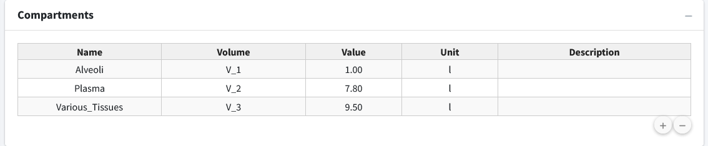

Next, we will add a concentration (**C**) variable for nicotine to each 
compartment and give an initial concentration of 1.2 mol to **C_1**. 

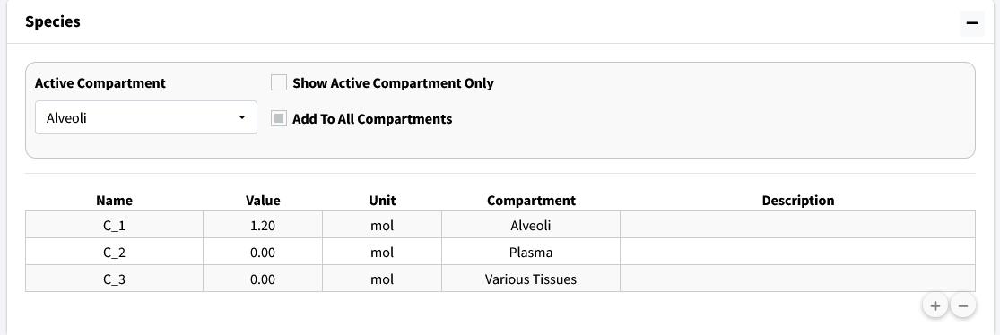

Next, we need to add the compartment input/outputs.  We have three to add:

#. Flow between Alveoli and Plasma

   .. figure:: tutorial_parameter_estimation/images/3_flow_1_add.png

#. Flow out of Plasma

   .. figure:: tutorial_parameter_estimation/images/3_flow_2_add.png

#. Simple diffusion between Plasma and Various_Tissues

   .. figure:: tutorial_parameter_estimation/images/3_flow_PS_add.png

With all our model components constructed, we need to assign parameter values. 
We do not know the value of PS but we will give the model a reasonable
starting estimate (0.5 L/min). 

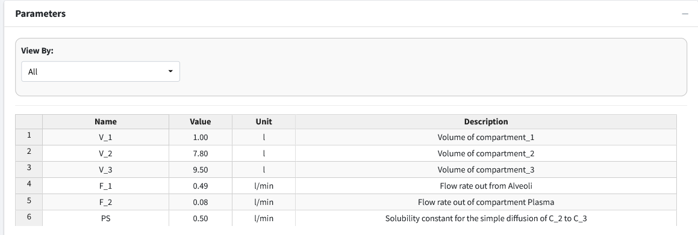

.. note:: The parameter table rounds to two decimal places. This is why F_2
          shows as 0.08 in the table. If you double-click the value it will
          show as the appropriate 0.078. 

For reference, here are the solved differential equations: 

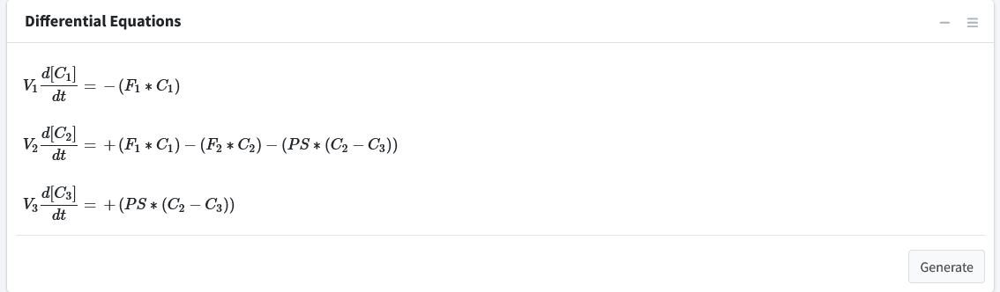

Move to the **Execute Model** tab and enter the time for this model: 

* Start Time = 0
* End Time = 70
* Time Step = 1
* Unit = min

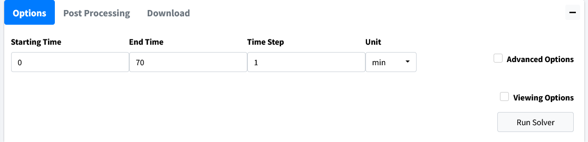

The beginning of the results table should look like this: 

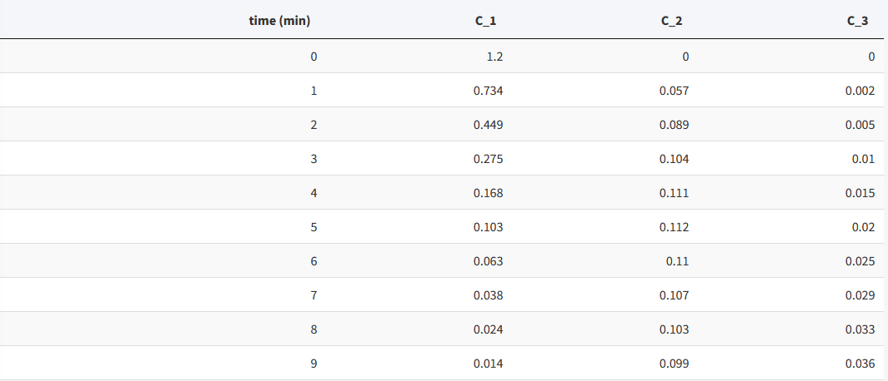

Visualize Model
--------------------

Move to the **Visualization** tab. A starting plot should be generated that 
looks like: 

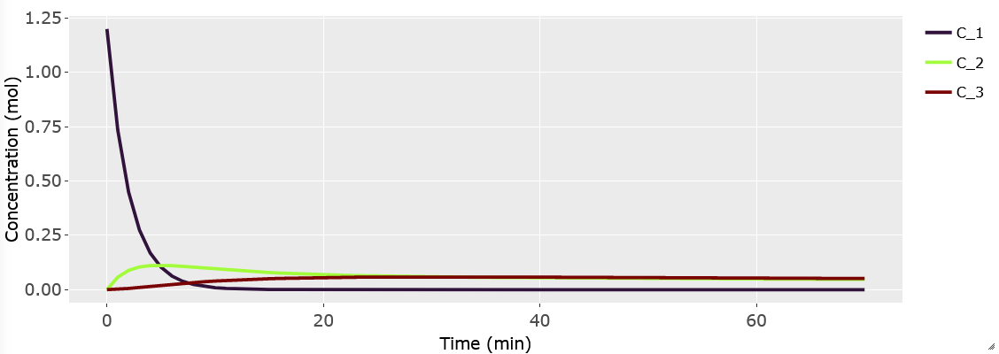

We want to examine the concentration of Nicotine in plasma (**C_2**).
Go into the **Variables** dropdown and remove variables **C_1** and **C_3**.

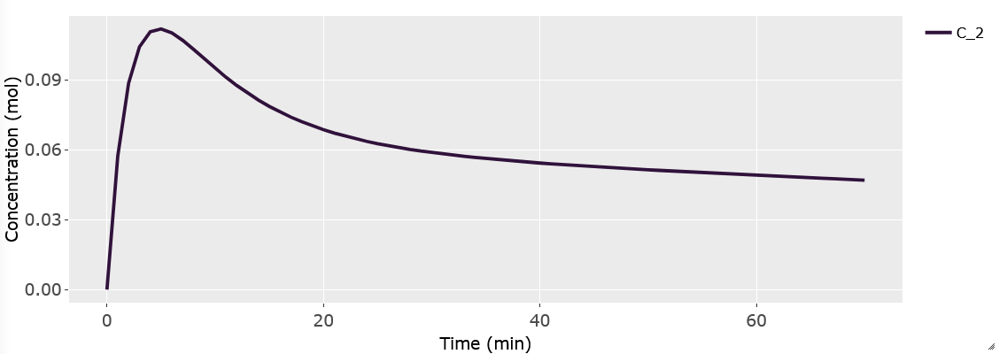

We should import our data for Nicotine in the plasma to overlay with the plot. 
Scroll below the plot to the box header that is titled **Import Data**.  
Browse your desktop for the nicotine dataset (which can be downloaded from our
 GitHub). Be sure to click the **Apply Overlay** checkbox to show the imported
data. For importing data, the first row of the data is the headers. The first
column should be time while the remaining columns should be your concentrations
at those times. The header names have to match the model names for the data to 
be correctly plotted. 

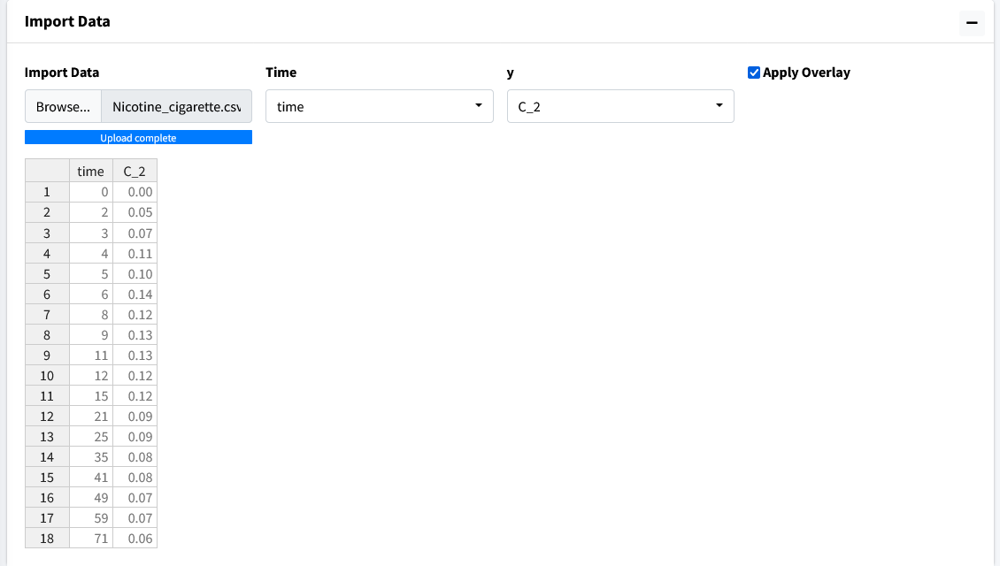

The resulting plot should look like the figure below: 

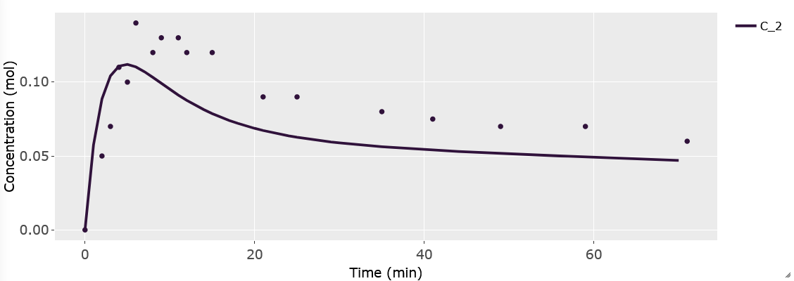

In this overlayed plot, we can see our model has the general shape of our data
but doesn't quite mimic it well. We will run parameter estimation for **PS** to 
see if we can find a better fit. 

Perform Parameter Estimation
---------------------------------

Go to the **Modeler's Toolbox** Tab, subtab **Parameter Estimation**. Here, we
will start by importing our data into this module. 

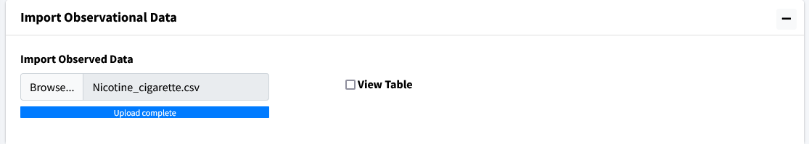

Move to the next box on the page **Select Parameters**. Use the dropdown to 
select **PS**. 

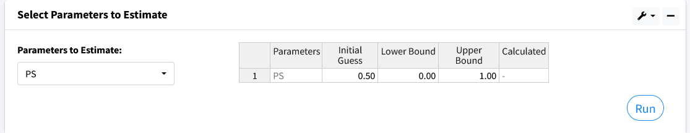

There are five columns in the generated table. They are as follows: 

* Parameters - the selected values to estimate.
* Initial Guess - the starting value to begin parameter estimation at.
* Lower Bound - the lowest acceptable value this parameter can be.
* Upper Bound - the highest acceptable value this parameter can be. 
* Calculated Value - the found value from parameter estimation after calculations.

Values for Lower and Upper bound can be left blank if no bounds want to be used.
Here we use the following: 

* Initial Guess - 0.50
* Lower Bound - 0
* Upper Bound - 1

Press the **Run** button and the program should output a value of approximately
0.10. 

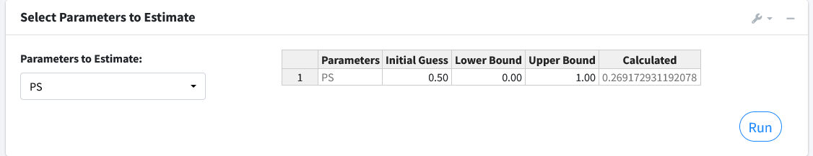

The next box **Estimation Results** will contain the model fit of the variable 
with its corresponding data along with the results of the iterations of the
parameter estimation algorithm. 

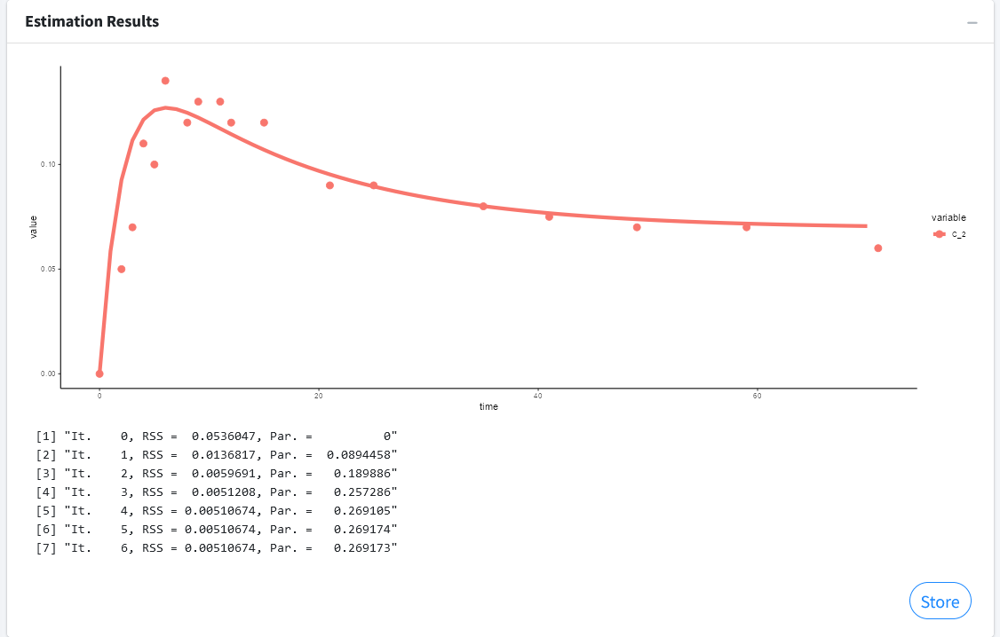

Press the **Store** button to overwrite your current parameters in the model
with the estimated values. 

.. note:: You can estimate as many parameters as you want with this setup.
          Just note that the more uncertainty you introduce into your model the
          longer the algorithm can take to find a solution. It can also affect
          the probability of finding a solution.