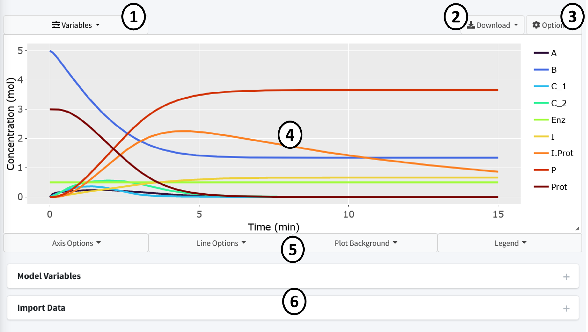
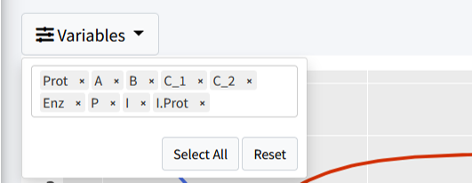
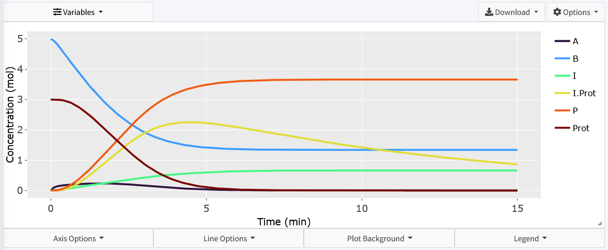

============================
Visualize Model
============================

This section will cover how to visualize our created model. 

Navigate to the "Visualization" tab on the lefthand tabbar. 

The plotting tab has four modes, we will cover two of them. In this section we 
will cover "Normal Plot" which is the default when you enter the tab.
The tab auto loads the plot when the model is solved, plotting all species 
of the model. These are the main features of the plot: 

#. Variables - Changes what species are plotting in the model.  
   All species in model are plotted by default.
#. Download - Dropdown containing options to download plot.
#. Options - Dropdown containing the following: 

   * Plot mode - Changes the plotting types and features.  
     Here we are plotting “Normal Plot”.
   * Plot Renderer – type of plot used. “plotly” is an interactive plot while 
     “ggplot2” is the standard R plotting. The interactive is the default as it 
     allows you to interact with the data using features such as zoom, pan, 
     and hovering over data to view its value.

#. Plot - Plot area with adjustable sizing on bottom right corner.
#. Plot Options – Four dropdowns that allow the addition of labels, 
   change of axis sizing, and control of line color and size.
#. Boxes containing menus to change model variables and import datasets to 
   plot.

By default the page should look like above when this tutorial model is solved.
All variables are displayed using a evenly spaced rainbow pattern coloring.

Press the “Variables” dropdown to change the species plotted in the graph.  
Press the “x” on the species to remove them.  The “Select All” button 
reselects all species while the “Reset” button removes all species.

Let's remove the following species to clean the plot up:

* C_1
* C_2
* Enz

We now have a less cluttered plot: 

The interactive plot uses Plotly (https://plotly.com/r/plotly-fundamentals/) 
as a render and includes many of its base features including:

#. By clicking on a variable in the legend, they can be removed from the plot.  
#. Double clicking a legend variable will remove all species but that one 
   from the plot. 
#. The top right bar includes options to pan, hover, and zoom the plot.
#. Press, hold, and drag the mouse on the plot to select specific features.
#. By hovering over lines on the plot, a popup will show with the values 
   at that point.

There are many features included to let the user make the plot there own.  
These are all located in the dropdowns below the plot.  
Here, almost any feature of the plot is customizable.  
Feel free to play around and make the plot your own. 
