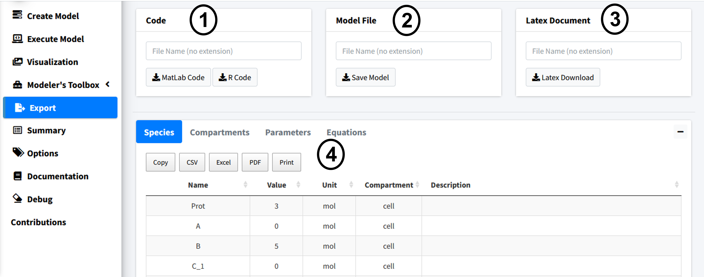
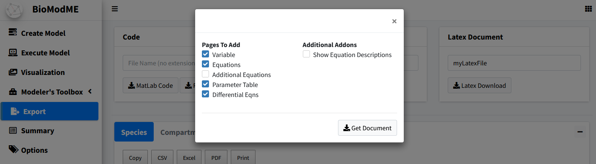
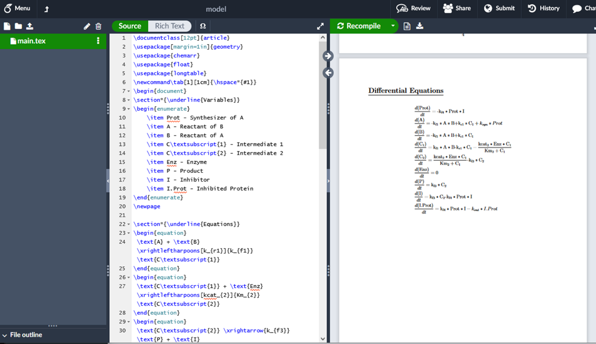

============================
Export
============================

BioModME allows the built model to be exported into 4 main categories:

#. Prebuild, ready to run code, for either MATLAB or R.
#. An “.rds” file (type of R data file) that can be reloaded into the program.
   This is the way to save and load a model into the program currently. 
#. A prebuild latex document all main model information.
#. Downloading tables for parameters, equations, and initial conditions in csv,
   txt, or pdf form.

    

Feel free to try the code export if you have an interest in solving your 
model in those programming languages.  Make sure to give any downloaded file 
a name. 

Latex
--------------------------------------

When downloading the latex document a popup will appear, showing 
further customization options for that document.

In this example, we will remove the “Additional equations” page as we did not 
create any non-standard equations. The generated document is created as a text
file that can be copied to our latex editor of choice and run.  I recommend 
using overleaf (www.overleaf.com) but any TeX editor will work. 
Below is a figure of the overleaf output:

