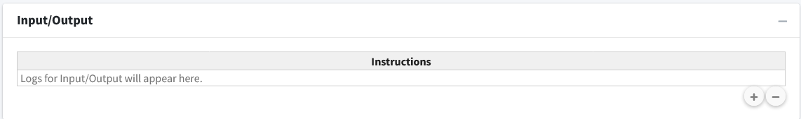

============================
Compartment Input/Output
============================

The next box is the Input/Output box.  This box is used to add flow/transfers 
between compartments.  Our model does not have any flows to account for so we 
will not use this box for anything.

|
