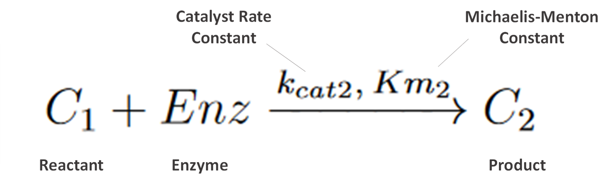

============================
Create Reactions
============================

Scroll down to the "Reactions" box in the "Create Model" tab. In this
section we will build up the sets of reactions that make up our reaction 
network.  Press the "+" button to begin adding equations.

Equation 1 - Law of Mass Action, Reversible
-----------------------------------------------

.. image:: images/eqn1.png
    :scale: 25%
    :align: center 

|

Chemical reactions like this follow the **law of mass action**. 
This first equation is a reversible reaction. The equation consists of two 
reactants, one product, and moves in both directions where are forward rate 
constant is “k_f1” and our reverse is “k_r1”.   

This reaction input can be seen in the below figure.  
The steps for the following equation are: 

#. Select “Chemical Reaction” for equation type. 
#. Select “Mass Action” as the law.
#. Select “Reversible” as the reaction direction.
#. Set the equation to have two reactants and one product.
#. Fill out equation information. Rate constant names are autogenerated for all 
   equation types using the number of the current equation as their number 
   at the end.
#. This is the equation builder that shows what your built equation looks like.
#. Press the "Add Equation" button. 

|

Equation 2 - Michaelis-Menton Kinetics
-----------------------------------------------

|

Next, we enter the second equation, conversion of C1 to C2 by the enzyme "Enz".  
These reactions follow Michaelis-Menten kinetics. Figure 7 shows how this 
equation looks entered the program. 

The steps are as follows:

#. Change the Reaction Type dropdown to “Enzyme Based Reaction”. 
#. Select “Michaelis Menten" as the Law.
#. Enter the equation information into the builder. 
#. Press the "Add Equation" Button.

.. image:: images/02_reactions_eqn_2_marked.png
    :align: center 

|

Equation 3 - Law of Mass Action, Unidirection
----------------------------------------------------

.. image:: images/eqn3.png
    :scale: 62%
    :align: center 

|

The next reaction is a conversion of C2 to product P and inhibitor I. 
This is a one directional reaction with one reactant and two products following
the law of mass action.  
 
#. Change the Equation Type dropdown to “Chemical Reaction”. 
#. Select “Mass Action” as the Law.
#. Change the reversability option to "Irreversible".
#. Set the Number of Reactants to "1" and the Number of Products to “2”.
#. Enter the equation information into the builder.  
#. Press “Add Equation” button.

|

Equation 4 - Law of Mass Action, Unidirection
---------------------------------------------------

|

Our next reaction is the inhibitor of Prot. This is another chemical reaction 
following the law of mass as in Equations 1 and 3 with two Reactants I and Prot
converted to I.Prot. The user interface input is below in Figure 9. 
The steps should be familiar to your by now, but they are as follows: 

#. Change the Reaction Type dropdown to “Chemical Reaction”. 
#. Select “Mass Action” as the Law.
#. Change the reversability option to "Irreversible".
#. Set the Number of Reactants to "2" and the Number of Products to “1”.
#. Enter the equation information into the builder.  
#. Press “Add Equation” button.

|

Equation 5 - Synthesis by Factor
---------------------------------------------

|

Our next reaction is the synthesis of A by Prot, where Prot is a factor 
promoting synthesis (as opposed to being directly converted).  

#. Set the Reaction Type to "Chemical Reaction". 
#. Change the Reaction Law dropdown to “Synthesis”.
#. Click the "Factor Driving Synthesis?" checbox.
#. Fill out equation builder with the species to synthesize and its 
   corresponding factor.
#. Press the “Add Equation” button

|

Equation 6 - Degradation by Rate
-----------------------------------------

|

Our final reaction is the degradation of I.Prot by a rate. 
This is useful for when we know the rate at which a protein is degraded in 
the cell but do not really know what is causing the degradation.  
These are often concentration dependent. 

#. Set the Reaction Type to "Chemical Reaction".
#. Change the Reaction Law dropdown to “Degradation (Rate)”.
#. Fill out equation builder with the species to degrade and its rate constant.
#. Make sure the “Concentration Dependent” box is checked.
#. Press the "Add Equation" button.

|