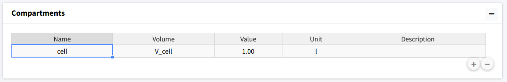
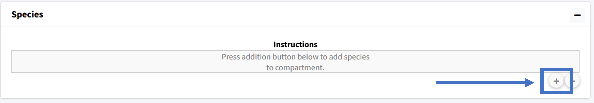
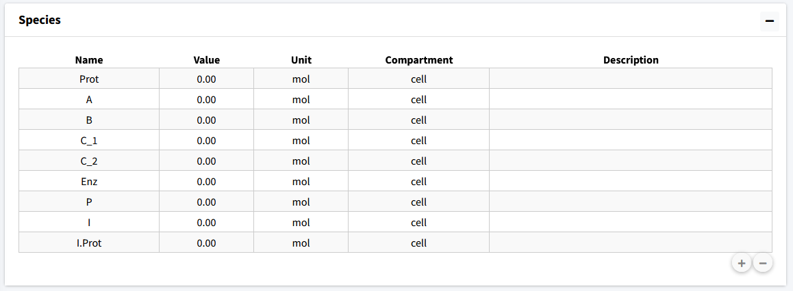
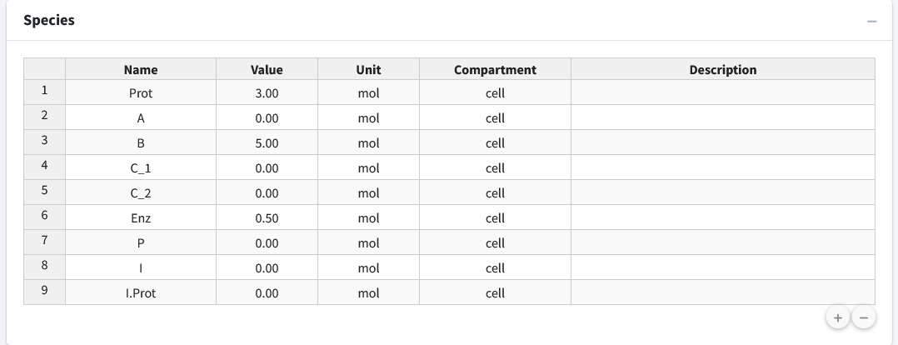
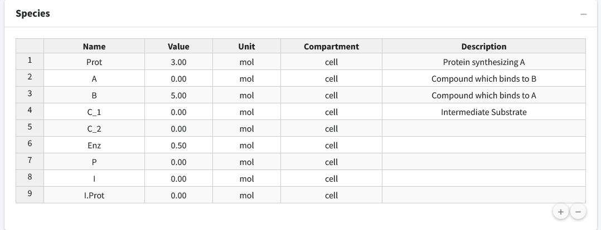

============================
Define Variables
============================

The application loads on the “Create Model” tab.  
Here, we will build our model, setting up variables, equations, and parameters.
Each of these components are their own box on the page. 
On load, the application will create a starting compartment named “comp_1”, 
which can be seen in the “Compartments” box. 
Click on the “Name” cell of the table to change the compartments name (cell).
We will also change the volume name here (V_cell). 
In a single compartment model, the physical volume is not of much importance 
so we will leave that as a value of 1 to avoid any model scaling effects.   

Next, the model species will be added.  To add a species, move to the next box 
(“Species”).  Here we press the button with a plus icon to add species whose 
information can be edited in the table.

We will add nine species to the model and then rename them appropriately: 
Prot, A, B, C_1, C_2, Enz, P, I, I.Prot

The second column of the species is “Value”, which is the initial amount of 
that species in the model.  For this model we have the following initial 
concentrations: 

* Prot = 3
* A = 0
* B = 5
* C_1 = 0
* C_2 = 0
* Enz = 0.5
* P = 0
* I = 0
* I.Prot = 0

Lastly, if desired, we can add descriptions to our species to remind ourselves 
(or let other users) know what the species in the model are.  Below, we have 
entered brief descriptions the beginning species. Editing can be done by 
clicking the appropriate cell in the species table. 

