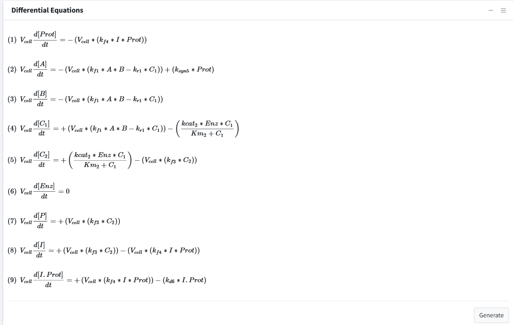

Differential Equations
============================

Navigate to the final box “Differential Equations”. 

This tab is used to generate and see the mathematical equations that govern 
our model.  This tab will begin with all species being equal to “NA” until the 
generate button is pressed or model is executed.  

Differential equations are solved for whenever an equation is added.
The "Generate" button is used to refresh the viewing of the differential 
equations if necessary.

**Note:** The right sidebar of the "System of Differential Equations" box has an 
option for viewing the differential equations including turning off the math 
rendering and showing each derivation line as a newline for each differential
equation. 
