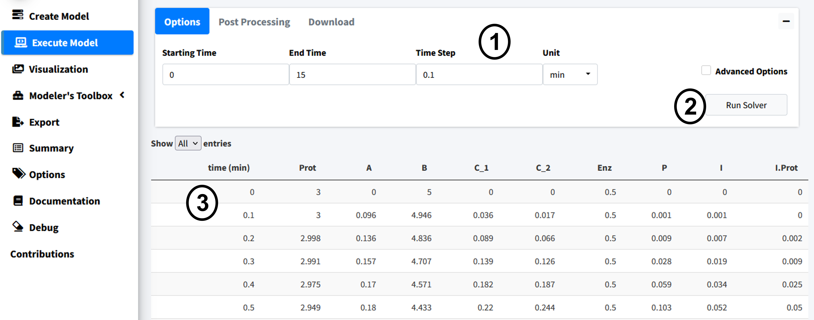

Solve Model 
============================

Navigate to the "Execute Model" tab on the lefthand tabbar. This tab solves our 
model and provides us with the options to customize the solver. For this model,
we will just solve using the standard options:

#. Enter the following times: Starting = 0, End = 15, Step = 0.1, Unit = min.  
   This generates the model to be solved and integrated at time points 0, 0.1,
   0.2…..14.8, 14.9, 15. 
#. Press the "Run Solver" button. 
#. An output table should be generated with the concentration of each species 
   along each time step of the solved model. 

You can download this solved model data to a csv file in the 
download tab on this page.  Post processing is not used in this tutorial. 

