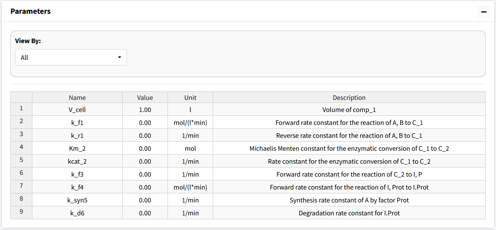
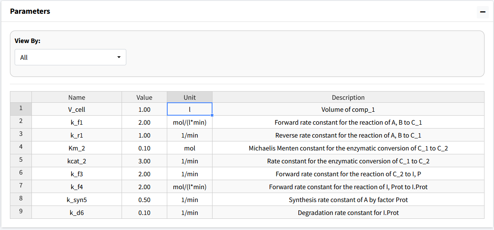

Parameters
============================

Navigate to the next box: **Parameters**. 

Below is the generated parameter table that has been created so far by the 
above entered information. All descriptions are pregenerated based on where 
the parameter originated. Like other tables, all values are editable.

|

The parameter values for the model are as follows: 

* k_f1 = 2 
* k_r1 = 1
* Km_2 = 0.1 
* kcat_2 = 3 
* k_f3 = 2 
* k_f4 = 2 
* k_s5 = 0.5
* k_d6 = 0.1 

The below figure shows the parameter table with the values entered.

|